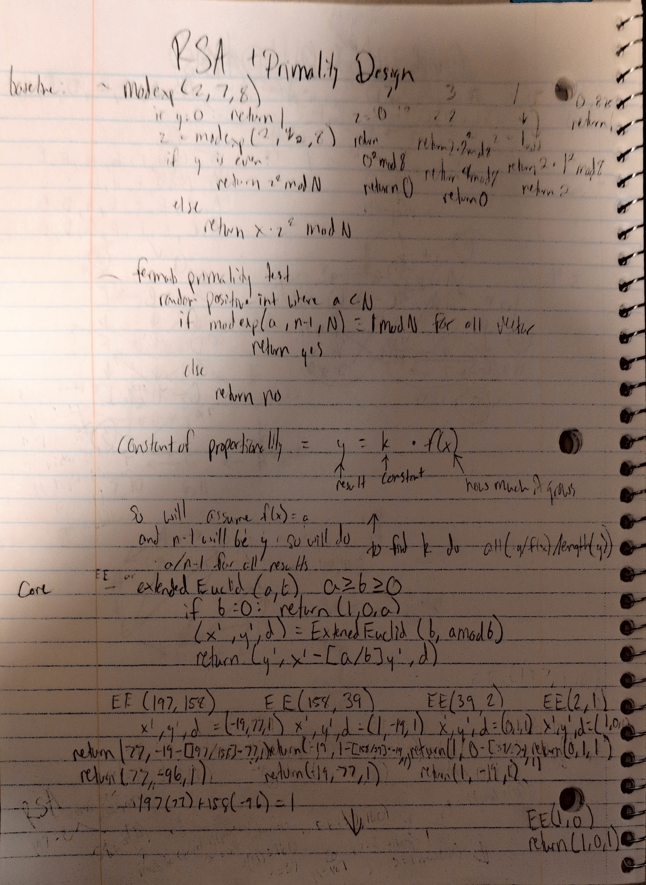
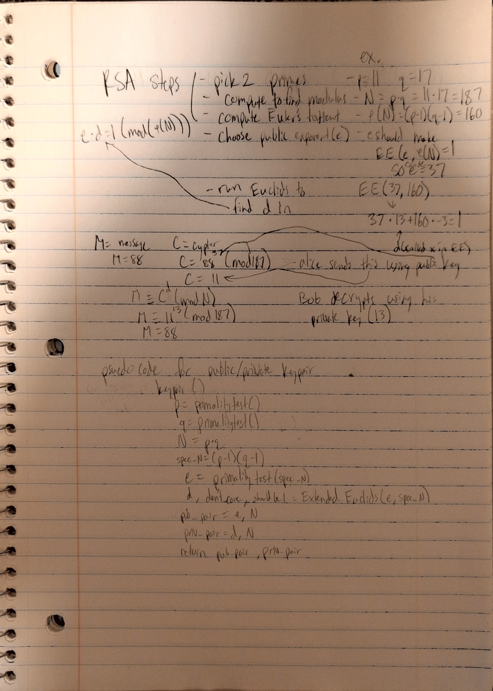
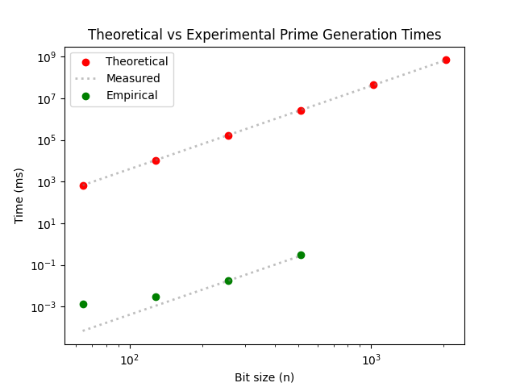

# Project Report - RSA and Primality Tests

## Baseline

### Design Experience




### Theoretical Analysis - Prime Number Generation

#### Time 

##### mod_exp() Function
```py 
def mod_exp(x: int, y: int, N: int) -> int:
    if (y == 0):                           # O(1) - comparing is constant time
        return 1                           # O(1) - returning is constant
    z = mod_exp(x,y//2,N)                  # O(n) - is recursive and will be called y/2 times which makes it O(log y) but it's O(n) because y has n bits
    if (y % 2 == 0):                       # O(1) - comparison is constant time
        return (z * z) % N                 # O(n^2) - because of the multiplication and modulo
    else:
        return (x * (z * z) % N)           # O(n^2) - for the multiplication and modulo
```

Total time complexity is O(n^3) because the depth of recursion costs O(n) and the cost of each call is O(n^2). When combined through multiplication these complexities equal O(n^3).

##### fermat() Function
```py
def fermat(N: int, k: int) -> bool:
    """
    Returns True if N is prime
    """
    for i in range(k):                        # O(k) - repeats k times
        pos_prime = random.randint(2, N - 2)  # O(n) - because it has to generate a n bit integer
        if mod_exp(pos_prime, N - 1, N) != 1: # O(n^3) - because mod_exp() is a O(n^3) operation
            return False                      # O(1) - return is constant time
    return True                               # O(1) - return is constant time
```

Total time complexity is O(kn^3) because each iteration costs O(n^3) and there are O(k) iterations. Combining these two time complexities gives us O(kn^3).

##### miller_rabin() Function
```py
def miller_rabin(N: int, k: int) -> bool:
    """
    Returns True if N is prime
    """
    if N < 2 or N % 2 == 0:            # O(n^2) - O(1) for comparison but the modulo makes it O(n^2)
        return False                   # O(1) - return is constant time
    if N in (2, 3):                    # O(1) - comparison is constant time
        return True                    # O(1) - return is constant time
    d = N - 1                          # O(n) - depending on bit size can be up to O(n) for time complexity
    s = 0                              # O(1) - assigning variable is constant
    while d % 2 == 0:
        d = d//2                       # O(n^3) - it is O(n^2) for division and it will be called O(n) times so combining the two gives us O(n^3).
        s += 1
    for i in range(k):                 # O(k) - because everything will be repeated k times
        a = random.randrange(2, N - 1) # O(n) - because it has to generate an n bit integer
        x = mod_exp(a, d, N)           # O(n^3) - because mod_exp() has a time complexity of O(n^3)
        if x == 1 or x == N - 1:       # O(n) - comparison is O(1) but subtraction can be up to O(n) which makes it O(n)
            continue
        for j in range(s - 1):         # O(n) - can repeat up to n times
            x = (x * x) % N            # O(n^2) - for the multiplication and modulo
            if x == N - 1:             # O(n) - comparison is O(1) but subtraction can be up to O(n)
                break
            else:
                return False           # O(1) - return is constant
    return True                        # O(1) - return is constant
```

Total time complexity is O(kn^3) because mod_exp() is complexity O(n^3) and it will be called k number of times.

##### generate_large_prime() Function
```py
def generate_large_prime(n_bits: int) -> int:
    """Generate a random prime number with the specified bit length"""
    while True:                                # O(n) - because it will repeat until a prime is found
        candidate = random.getrandbits(n_bits) # O(n) - because the number it generates can be up to n bits
        candidate |= (1 << (n_bits - 1))       # O(1) - constant because only changing variable
        candidate |= 1                         # O(1) - constant because only changing one variable
        if fermat(candidate, 20):              # O(n^3) - because calling fermat()
            if miller_rabin(candidate, 20):    # O(n^3) - because calling miller_rabin()
                return candidate               # O(1) - return is constant
```

Total time complexity is O(n^4) because the while loop will be run O(n) times and each time it is run there is a complexity of O(n^3) which makes the total complexity O(n^4).


##### Total Time Complexity

The total time complexity of the program will be O(n^4) because that is how long the most complex function(generate_large_prime()) will take to run.

#### Space

##### mod_exp() Function

```py
def mod_exp(x: int, y: int, N: int) -> int:
    if (y == 0):
        return 1
    z = mod_exp(x,y//2,N)
    if (y % 2 == 0):
        return (z * z) % N
    else:
        return (x * (z * z) % N)
```

Each recursive call requires x, y, N, and z to be stored which will require O(n) space. In addition, the depth of the recursion can take up to O(n) so the total space would be O(n) time O(n) which is O(n^2).

##### fermat() Function
```py
def fermat(N: int, k: int) -> bool:
    """
    Returns True if N is prime
    """
    for i in range(k):
        pos_prime = random.randint(2, N - 2)
        if mod_exp(pos_prime, N - 1, N) != 1:
            return False
    return True
```

Holds a few n bit values like pos_prime, N and the return values which takes up to O(n) space. Also takes up O(n^2) space for mod_exp() which is the biggest amount of space required and makes the total space O(n^2).

##### miller_rabin() Function

```py 
def miller_rabin(N: int, k: int) -> bool:
    """
    Returns True if N is prime
    """
    if N < 2 or N % 2 == 0:
        return False
    if N in (2, 3):
        return True
    d = N - 1
    s = 0
    while d % 2 == 0:
        d = d//2
        s += 1
    for i in range(k):
        a = random.randrange(2, N - 1)
        x = mod_exp(a, d, N)
        if x == 1 or x == N - 1:
            continue
        for j in range(s - 1):
            x = (x * x) % N
            if x == N - 1:
                break
            else:
                return False
    return True
```

Holds N, d, s, a, and x which is O(n) and loops add a constant amount of memory but all of this is overshadowed by mod_exp() making the total space needed O(n^2).

##### generate_large_prime() Function

```py
def generate_large_prime(n_bits: int) -> int:
    """Generate a random prime number with the specified bit length"""
    while True:
        candidate = random.getrandbits(n_bits)
        candidate |= (1 << (n_bits - 1))
        candidate |= 1
        if fermat(candidate, 20):
            if miller_rabin(candidate, 20):
                return candidate
```

Only stores one variable which can be up to O(n) but this is overshadowed by its calls to fermat() and miller_rabin() which cost O(n^2) which makes the total complexity O(n^2).

##### Total Space Complexity

The program should use up to O(n^2) space.

### Theoretical Data

| N    | time (ms)   |
|------|-------------|
| 64   | 671         |
| 128  | 10,740      |
| 256  | 17.2 * 10^4 |
| 512  | 27.5 * 10^5 |
| 1024 | 43.9 * 10^6 |
| 2048 | 70.4 * 10^7 |

### Empirical Data

| N    | time (ms) |
|------|-----------|
| 64   | 0.00138   |
| 128  | 0.00283   |
| 256  | 0.01724   |
| 512  | 0.31531   |
| 1024 | NA        |
| 2048 | NA        |

### Comparison of Theoretical and Empirical Results

- Theoretical order of growth: O(n^2)
- Measured constant of proportionality for theoretical order: 0.00004
- Empirical order of growth (if different from theoretical): 
- Measured constant of proportionality for empirical order: 4 * 10^-12




## Core

### Design Experience

*Fill me in*

### Theoretical Analysis - Key Pair Generation

#### Time 

*Fill me in*

#### Space

*Fill me in*

### Empirical Data

| N    | time (ms) |
|------|-----------|
| 64   |           |
| 128  |           |
| 256  |           |
| 512  |           |
| 1024 |           |
| 2048 |           |

### Comparison of Theoretical and Empirical Results

- Theoretical order of growth: *copy from section above* 
- Measured constant of proportionality for theoretical order: 
- Empirical order of growth (if different from theoretical): 
- Measured constant of proportionality for empirical order: 


*Fill me in*

## Stretch 1

### Design Experience

*Fill me in*

### Theoretical Analysis - Encrypt and Decrypt

#### Time 

*Fill me in*

#### Space

*Fill me in*

### Empirical Data

#### Encryption

| N    | time (ms) |
|------|-----------|
| 64   |           |
| 128  |           |
| 256  |           |
| 512  |           |
| 1024 |           |
| 2048 |           |

#### Decryption

| N    | time (ms) |
|------|-----------|
| 64   |           |
| 128  |           |
| 256  |           |
| 512  |           |
| 1024 |           |
| 2048 |           |

### Comparison of Theoretical and Empirical Results

#### Encryption

- Theoretical order of growth: *copy from section above* 
- Measured constant of proportionality for theoretical order: 
- Empirical order of growth (if different from theoretical): 
- Measured constant of proportionality for empirical order: 


*Fill me in*

#### Decryption

- Theoretical order of growth: *copy from section above* 
- Measured constant of proportionality for theoretical order: 
- Empirical order of growth (if different from theoretical): 
- Measured constant of proportionality for empirical order: 


*Fill me in*

### Encrypting and Decrypting With A Classmate

*Fill me in*

## Stretch 2

### Design Experience

*Fill me in*

### Discussion: Probabilistic Natures of Fermat and Miller Rabin 

*Fill me in*

## Project Review

*Fill me in*

