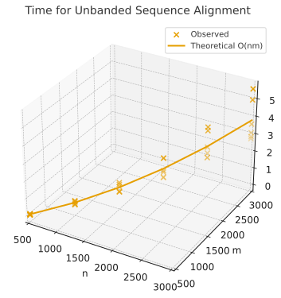
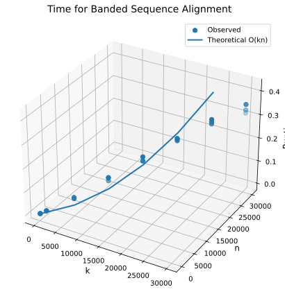

# Project Report - Alignment

## Baseline

### Design Experience

Talked with Michael about everything in my design notes and answered the other questions.

### Theoretical Analysis - Unrestricted Alignment

#### Time 

```py 
def align(
        seq1: str,
        seq2: str,
        match_award=-3,
        indel_penalty=5,
        sub_penalty=1,
        banded_width=-1,
        gap_open_penalty=0,
        gap='-',
) -> tuple[float, str | None, str | None]:  # O(nm) - biggest operations (calling functions) cost O(nm)
    """
        Align seq1 against seq2 using Needleman-Wunsch
        Put seq1 on left (j) and seq2 on top (i)
        => matrix[i][j]
        :param seq1: the first sequence to align; should be on the "left" of the matrix
        :param seq2: the second sequence to align; should be on the "top" of the matrix
        :param match_award: how many points to award a match
        :param indel_penalty: how many points to award a gap in either sequence
        :param sub_penalty: how many points to award a substitution
        :param banded_width: banded_width * 2 + 1 is the width of the banded alignment; -1 indicates full alignment
        :param gap_open_penalty: how much it costs to open a gap. If 0, there is no gap_open penalty
        :param gap: the character to use to represent gaps in the alignment strings
    """

    s1 = len(seq1)
    s2 = len(seq2)
    if s1 == 0 or s2 == 0:
        if s1 == 0:
            return indel_penalty * s2, gap * s2, seq2
        else:
            return indel_penalty * s1, seq1, gap * s1
    if banded_width == -1:
        type = "matrix"
        table = make_unbanded([], s1, s2, indel_penalty) # O(nm) - function takes O(nm) time to go over every cell
        filled_table = unbanded_fill_table(table, s1, seq1, s2, seq2, match_award, sub_penalty, indel_penalty) # O(nm) - because function goes over every cell in table which takes O(nm) time
    else:
        if abs(s1-s2) > 5:
            return math.inf, None, None
        type = "dict"
        table = make_banded({}, banded_width, indel_penalty)
        filled_table = banded_fill_table(table, seq1, seq2, match_award, sub_penalty, indel_penalty, banded_width)
    cost = get_value(filled_table, type, s1, s2)
    word1, word2 = traceback(filled_table, type, seq1, s1, seq2, s2, match_award, sub_penalty, indel_penalty, gap)  # O(n + m) - function's highest potential time is n + m
    return cost, word1, word2


def make_unbanded(table, rows, columns, gap): # O(nm) - everything other than the for loops takes constant time and the outer for loop takes the most time
    for row in range(rows + 1):             # O(nm) - each call is O(n) because of the inside for loop and this loop repeats m times
        values = []
        for column in range(columns + 1):   # O(n) - repeats n times
            if row == 0:
                if column == 0:
                    values.append(0)
                else:
                    values.append(values[column - 1] + gap)
            elif column == 0:
                values.append(table[row - 1][0] + gap)
            else:
                values.append(None)
        table.append(values)
    return table


def unbanded_fill_table(table, rows, word1, columns, word2, match, sub, gap):  # O(nm) - biggest time cost is the outer for loop which goes over every item in word1 (n) m times
    for row in range(1, rows + 1):    # O(nm) - goes over each item in word1 (m) n times
        for column in range(1, columns + 1): # O(n) - goes over each item in word2 (n)
            if word1[row - 1] == word2[column - 1]:
                d = table[row - 1][column - 1] + match
            else:
                d = table[row - 1][column - 1] + sub
            u = table[row - 1][column] + gap
            l = table[row][column - 1] + gap
            table[row][column] = min(d, u, l)
    return table


def get_value(table, type, row, column): # O(1) - everything in here takes about constant time and only happens once per call
    if type == "matrix":
        return table[row][column]
    else:
        return table.get((row, column))


def traceback(table, type, word1, length, word2, width, match, sub, gap, gap_char):  # O(n + m) - because of the while loop
    aligned_1 = ""
    aligned_2 = ""
    has_left = True
    has_up = True
    has_diag = True
    while length > 0 or width > 0: # O(n + m) - while loop has potential to repeat n number of times (length), m number of times (width), or both (length and width) which is n + m
        if type == "dict":
            has_left = (length, width - 1) in table
            has_up = (length - 1, width) in table
            has_diag = (length - 1, width - 1) in table
        is_matched = word1[length - 1] == word2[width - 1]
        if is_matched:
            cost = match
        else:
            cost = sub
        if length > 0 and width > 0 and has_diag and get_value(table, type, length, width) == get_value(table, type, length - 1, width - 1) + cost:
            aligned_1 = word1[length - 1] + aligned_1
            aligned_2 = word2[width - 1] + aligned_2
            length = length - 1
            width = width - 1
        elif width > 0 and has_left and get_value(table, type, length, width) == get_value(table, type, length, width - 1) + gap:
            aligned_1 = gap_char + aligned_1
            aligned_2 = word2[width - 1] + aligned_2
            width = width - 1
        elif has_up:
            aligned_1 = word1[length - 1] + aligned_1
            aligned_2 = gap_char + aligned_2
            length = length - 1
    return aligned_1, aligned_2
```

The highest time cost comes from the creation and filling of the table. This is because while most of these functions 
only take constant time to perform each action, both of these functions contain an inner and outer for loop. These loops
mean that each of these actions are performed n times for each of m number of items which is why they cost so much. This
gives an overall time complexity of O(nm).

#### Space

```py 
def align(
        seq1: str,
        seq2: str,
        match_award=-3,
        indel_penalty=5,
        sub_penalty=1,
        banded_width=-1,
        gap_open_penalty=0,
        gap='-',
) -> tuple[float, str | None, str | None]:  # O(nm) - highest space cost is taken by tables creation and storage
    """
        Align seq1 against seq2 using Needleman-Wunsch
        Put seq1 on left (j) and seq2 on top (i)
        => matrix[i][j]
        :param seq1: the first sequence to align; should be on the "left" of the matrix
        :param seq2: the second sequence to align; should be on the "top" of the matrix
        :param match_award: how many points to award a match
        :param indel_penalty: how many points to award a gap in either sequence
        :param sub_penalty: how many points to award a substitution
        :param banded_width: banded_width * 2 + 1 is the width of the banded alignment; -1 indicates full alignment
        :param gap_open_penalty: how much it costs to open a gap. If 0, there is no gap_open penalty
        :param gap: the character to use to represent gaps in the alignment strings
    """

    s1 = len(seq1)
    s2 = len(seq2)
    if s1 == 0 or s2 == 0:
        if s1 == 0:
            return indel_penalty * s2, gap * s2, seq2
        else:
            return indel_penalty * s1, seq1, gap * s1
    if banded_width == -1:
        type = "matrix"
        table = make_unbanded([], s1, s2, indel_penalty) # O(nm) - function takes O(nm) space to add every cell
        filled_table = unbanded_fill_table(table, s1, seq1, s2, seq2, match_award, sub_penalty, indel_penalty) # O(nm) - because of table, without passed in table takes O(1)
    else:
        if abs(s1-s2) > 5:
            return math.inf, None, None
        type = "dict"
        table = make_banded({}, banded_width, indel_penalty)
        filled_table = banded_fill_table(table, seq1, seq2, match_award, sub_penalty, indel_penalty, banded_width)
    cost = get_value(filled_table, type, s1, s2)
    word1, word2 = traceback(filled_table, type, seq1, s1, seq2, s2, match_award, sub_penalty, indel_penalty, gap)  # O(n + m) - function's highest potential space is n + m
    return cost, word1, word2


def make_unbanded(table, rows, columns, gap): # O(nm) - each item being added to the list takes a constant amount of space but because of how many times it happens the total space taken is O(nm)
    for row in range(rows + 1):             # O(nm) - adding one item to the list takes constant time but this happens m number of times so it takes the space of storing n number of items and then adding a list of that size m number of times
        values = []
        for column in range(columns + 1):   # O(n) - adds only once at a time which takes constant space but this happens n times
            if row == 0:
                if column == 0:
                    values.append(0)
                else:
                    values.append(values[column - 1] + gap)
            elif column == 0:
                values.append(table[row - 1][0] + gap)
            else:
                values.append(None)
        table.append(values)
    return table


def unbanded_fill_table(table, rows, word1, columns, word2, match, sub, gap):  # O(nm) - technically costs O(nm) because that's the amount of space the table takes to store but everything that happens in the actual function takes up constant space so without the table this function costs O(1)
    for row in range(1, rows + 1): 
        for column in range(1, columns + 1): 
            if word1[row - 1] == word2[column - 1]:
                d = table[row - 1][column - 1] + match
            else:
                d = table[row - 1][column - 1] + sub
            u = table[row - 1][column] + gap
            l = table[row][column - 1] + gap
            table[row][column] = min(d, u, l)
    return table


def get_value(table, type, row, column): # O(nm) - the table takes nm space, otherwise this function takes constant space
    if type == "matrix":
        return table[row][column]
    else:
        return table.get((row, column))


def traceback(table, type, word1, length, word2, width, match, sub, gap, gap_char):  # O(nm) - because of the table, but without it the storage is only O(n + m) because of the aligned variables being added to in the while loop
    aligned_1 = ""
    aligned_2 = ""
    has_left = True
    has_up = True
    has_diag = True
    while length > 0 or width > 0: # O(n + m) - during each round aligned_1 (n) and aligned_2 (m) are added to once which takes constant time, but this happens until both length and width == 0 which means the that both of the aligns have require either n or m space but ultimately will take at most n + m space
        if type == "dict":
            has_left = (length, width - 1) in table
            has_up = (length - 1, width) in table
            has_diag = (length - 1, width - 1) in table
        is_matched = word1[length - 1] == word2[width - 1]
        if is_matched:
            cost = match
        else:
            cost = sub
        if length > 0 and width > 0 and has_diag and get_value(table, type, length, width) == get_value(table, type, length - 1, width - 1) + cost:
            aligned_1 = word1[length - 1] + aligned_1
            aligned_2 = word2[width - 1] + aligned_2
            length = length - 1
            width = width - 1
        elif width > 0 and has_left and get_value(table, type, length, width) == get_value(table, type, length, width - 1) + gap:
            aligned_1 = gap_char + aligned_1
            aligned_2 = word2[width - 1] + aligned_2
            width = width - 1
        elif has_up:
            aligned_1 = word1[length - 1] + aligned_1
            aligned_2 = gap_char + aligned_2
            length = length - 1
    return aligned_1, aligned_2
```

The table is what takes up the most space in all of the functions in this program. This is because it will have to store m number of n length items giving
a space complexity of O(nm).

### Empirical Data - Unrestricted Alignment

| N    | time (ms) |
|------|-----------|
| 500  | 0.1060147 |
| 1000 | 0.4474585 |
| 1500 | 0.9810832 |
| 2000 | 1.5694489 |
| 2500 | 2.5897398 |
| 3000 | 3.5843565 |


### Comparison of Theoretical and Empirical Results - Unrestricted Alignment

- Theoretical order of growth: O(nm)
- Empirical order of growth: same as theoretical




The theoretical and empirical seem to match

## Core

### Design Experience

Went over everything in my design notes and the other questions I didn't need references for with Michael


### Theoretical Analysis - Banded Alignment

#### Time 

```py 
def align(
        seq1: str,
        seq2: str,
        match_award=-3,
        indel_penalty=5,
        sub_penalty=1,
        banded_width=-1,
        gap_open_penalty=0,
        gap='-',
) -> tuple[float, str | None, str | None]: # O(kn) - calling banded_fill_table() will take the most amount of time and therefore is the big O of the function
    """
        Align seq1 against seq2 using Needleman-Wunsch
        Put seq1 on left (j) and seq2 on top (i)
        => matrix[i][j]
        :param seq1: the first sequence to align; should be on the "left" of the matrix
        :param seq2: the second sequence to align; should be on the "top" of the matrix
        :param match_award: how many points to award a match
        :param indel_penalty: how many points to award a gap in either sequence
        :param sub_penalty: how many points to award a substitution
        :param banded_width: banded_width * 2 + 1 is the width of the banded alignment; -1 indicates full alignment
        :param gap_open_penalty: how much it costs to open a gap. If 0, there is no gap_open penalty
        :param gap: the character to use to represent gaps in the alignment strings
    """

    s1 = len(seq1)
    s2 = len(seq2)
    if s1 == 0 or s2 == 0:
        if s1 == 0:
            return indel_penalty * s2, gap * s2, seq2
        else:
            return indel_penalty * s1, seq1, gap * s1
    if banded_width == -1:
        type = "matrix"
        table = make_unbanded([], s1, s2, indel_penalty)
        filled_table = unbanded_fill_table(table, s1, seq1, s2, seq2, match_award, sub_penalty, indel_penalty)
    else:
        if abs(s1-s2) > 5:
            return math.inf, None, None
        type = "dict"
        table = make_banded({}, banded_width, indel_penalty) # O(n) - function takes O(n)
        filled_table = banded_fill_table(table, seq1, seq2, match_award, sub_penalty, indel_penalty, banded_width) # O(kn) - function takes O(kn)
    cost = get_value(filled_table, type, s1, s2)
    word1, word2 = traceback(filled_table, type, seq1, s1, seq2, s2, match_award, sub_penalty, indel_penalty, gap) # O(k + n) - function takes O(k + n)
    return cost, word1, word2


def make_banded(table,size, gap):  # O(n) - the for loops cost the most and thereby are the big O cost of the function
    start = (0,0)
    prev = 0
    table[start] = 0
    for i in range(1, size + 1):  # O(n) - repeats n times
        table[(start[0], i)] = prev + gap
        prev += gap
    prev = 0
    for i in range(1, size + 1): # O(n) - repeats n times
        table[(i, start[1])] = prev + gap
        prev += gap
    return table


def banded_fill_table(table, word1, word2, match, sub, gap, size): # O(kn) - the while loop takes the most time
    inf = math.inf
    len1 = len(word1)
    len2 = len(word2)
    box = (1,1)
    prev_box = (1,1)
    start_col = 1
    while True: # O(kn) - the for loop repeats k times (for however many rows there will be)
        for i in range(-size, size + 1):  # O(n) - repeats n times
            if prev_box[1] + i < 0 or prev_box[1] + i > len2 or prev_box[1] + i == 0:
                continue
            box = (prev_box[0], prev_box[1] + i)
            is_match = word1[box[0] - 1] == word2[box[1] - 1]
            if is_match:
                d = table.get((box[0] - 1, box[1] - 1)) + match
            else:
                d = table.get((box[0] - 1, box[1] - 1)) + sub
            if (box[0] - 1, box[1]) in table:
                u = table.get((box[0] - 1, box[1])) + gap
            else:
                u = inf
            if (box[0], box[1] - 1) in table:
                l = table.get((box[0], box[1] - 1)) + gap
            else:
                l = inf
            table[box] = min(d,u,l)
        if not prev_box[0] + 1 > len1 and not start_col + 1 > len2:
            box = (prev_box[0] + 1, start_col + 1)
            prev_box = (prev_box[0] + 1, prev_box[1] + 1)
            start_col += 1
        elif not prev_box[0] + 1 > len1:
            box = (prev_box[0] + 1, start_col)
            prev_box = (prev_box[0] + 1, start_col)
        elif not start_col + 1 > len2:
            box = (prev_box[0], start_col + 1)
            prev_box = (prev_box[0], start_col + 1)
            start_col += 1
        else:
            break
    return table


def get_value(table, type, row, column): # O(1) - everything in here takes constant time
    if type == "matrix":
        return table[row][column]
    else:
        return table.get((row, column))


def traceback(table, type, word1, length, word2, width, match, sub, gap, gap_char): # O(k + n) - the only element in this function that does not take constant time is the while loop so it is the big O for the function
    aligned_1 = ""
    aligned_2 = ""
    has_left = True
    has_up = True
    has_diag = True
    while length > 0 or width > 0:  # O(k + n) - at most goes through all of length(k) and all of width(n)
        if type == "dict":
            has_left = (length, width - 1) in table
            has_up = (length - 1, width) in table
            has_diag = (length - 1, width - 1) in table
        is_matched = word1[length - 1] == word2[width - 1]
        if is_matched:
            cost = match
        else:
            cost = sub
        if length > 0 and width > 0 and has_diag and get_value(table, type, length, width) == get_value(table, type, length - 1, width - 1) + cost:
            aligned_1 = word1[length - 1] + aligned_1
            aligned_2 = word2[width - 1] + aligned_2
            length = length - 1
            width = width - 1
        elif width > 0 and has_left and get_value(table, type, length, width) == get_value(table, type, length, width - 1) + gap:
            aligned_1 = gap_char + aligned_1
            aligned_2 = word2[width - 1] + aligned_2
            width = width - 1
        elif has_up:
            aligned_1 = word1[length - 1] + aligned_1
            aligned_2 = gap_char + aligned_2
            length = length - 1
    return aligned_1, aligned_2
```

The most amount of time is taken up by filling the banded dictionary because it creates n number of new entries per k rows giving a big O of O(kn).

#### Space

```py 
def align(
        seq1: str,
        seq2: str,
        match_award=-3,
        indel_penalty=5,
        sub_penalty=1,
        banded_width=-1,
        gap_open_penalty=0,
        gap='-',
) -> tuple[float, str | None, str | None]: # O(kn) - calling banded_fill_table() will take the most amount of space and therefore is the big O of the function
    """
        Align seq1 against seq2 using Needleman-Wunsch
        Put seq1 on left (j) and seq2 on top (i)
        => matrix[i][j]
        :param seq1: the first sequence to align; should be on the "left" of the matrix
        :param seq2: the second sequence to align; should be on the "top" of the matrix
        :param match_award: how many points to award a match
        :param indel_penalty: how many points to award a gap in either sequence
        :param sub_penalty: how many points to award a substitution
        :param banded_width: banded_width * 2 + 1 is the width of the banded alignment; -1 indicates full alignment
        :param gap_open_penalty: how much it costs to open a gap. If 0, there is no gap_open penalty
        :param gap: the character to use to represent gaps in the alignment strings
    """

    s1 = len(seq1)
    s2 = len(seq2)
    if s1 == 0 or s2 == 0:
        if s1 == 0:
            return indel_penalty * s2, gap * s2, seq2
        else:
            return indel_penalty * s1, seq1, gap * s1
    if banded_width == -1:
        type = "matrix"
        table = make_unbanded([], s1, s2, indel_penalty)
        filled_table = unbanded_fill_table(table, s1, seq1, s2, seq2, match_award, sub_penalty, indel_penalty)
    else:
        if abs(s1-s2) > 5:
            return math.inf, None, None
        type = "dict"
        table = make_banded({}, banded_width, indel_penalty) # O(n) - function takes O(n)
        filled_table = banded_fill_table(table, seq1, seq2, match_award, sub_penalty, indel_penalty, banded_width) # O(kn) - function takes O(kn)
    cost = get_value(filled_table, type, s1, s2)
    word1, word2 = traceback(filled_table, type, seq1, s1, seq2, s2, match_award, sub_penalty, indel_penalty, gap) # O(kn) - function takes O(kn) because of dict but without it takes O(k + n)
    return cost, word1, word2


def make_banded(table,size, gap):  # O(n) - the for loops cost the most and thereby are the big O cost of the function
    start = (0,0)
    prev = 0
    table[start] = 0
    for i in range(1, size + 1):  # O(n) - repeats n times
        table[(start[0], i)] = prev + gap
        prev += gap
    prev = 0
    for i in range(1, size + 1): # O(n) - repeats n times
        table[(i, start[1])] = prev + gap
        prev += gap
    return table


def banded_fill_table(table, word1, word2, match, sub, gap, size): # O(kn) - the while loop takes the most space
    inf = math.inf
    len1 = len(word1)
    len2 = len(word2)
    box = (1,1)
    prev_box = (1,1)
    start_col = 1
    while True: # O(kn) - the for loop repeats k times (for however many rows there will be) which means the amount of space required will be n for each time it is called (k)
        for i in range(-size, size + 1):  # O(n) - n number of entries are added
            if prev_box[1] + i < 0 or prev_box[1] + i > len2 or prev_box[1] + i == 0:
                continue
            box = (prev_box[0], prev_box[1] + i)
            is_match = word1[box[0] - 1] == word2[box[1] - 1]
            if is_match:
                d = table.get((box[0] - 1, box[1] - 1)) + match
            else:
                d = table.get((box[0] - 1, box[1] - 1)) + sub
            if (box[0] - 1, box[1]) in table:
                u = table.get((box[0] - 1, box[1])) + gap
            else:
                u = inf
            if (box[0], box[1] - 1) in table:
                l = table.get((box[0], box[1] - 1)) + gap
            else:
                l = inf
            table[box] = min(d,u,l)
        if not prev_box[0] + 1 > len1 and not start_col + 1 > len2:
            box = (prev_box[0] + 1, start_col + 1)
            prev_box = (prev_box[0] + 1, prev_box[1] + 1)
            start_col += 1
        elif not prev_box[0] + 1 > len1:
            box = (prev_box[0] + 1, start_col)
            prev_box = (prev_box[0] + 1, start_col)
        elif not start_col + 1 > len2:
            box = (prev_box[0], start_col + 1)
            prev_box = (prev_box[0], start_col + 1)
            start_col += 1
        else:
            break
    return table


def get_value(table, type, row, column): # O(kn) - the table takes kn space but everything else in here takes constant space
    if type == "matrix":
        return table[row][column]
    else:
        return table.get((row, column))


def traceback(table, type, word1, length, word2, width, match, sub, gap, gap_char): # O(kn) - the table takes kn space, other wise adding to each of the aligned costs at most O(k + n)
    aligned_1 = ""
    aligned_2 = ""
    has_left = True
    has_up = True
    has_diag = True
    while length > 0 or width > 0:  # O(k + n) - at most adds elements to aligned_1 and aligned_2 k + n times since it will go through at most length + width times
        if type == "dict":
            has_left = (length, width - 1) in table
            has_up = (length - 1, width) in table
            has_diag = (length - 1, width - 1) in table
        is_matched = word1[length - 1] == word2[width - 1]
        if is_matched:
            cost = match
        else:
            cost = sub
        if length > 0 and width > 0 and has_diag and get_value(table, type, length, width) == get_value(table, type, length - 1, width - 1) + cost:
            aligned_1 = word1[length - 1] + aligned_1
            aligned_2 = word2[width - 1] + aligned_2
            length = length - 1
            width = width - 1
        elif width > 0 and has_left and get_value(table, type, length, width) == get_value(table, type, length, width - 1) + gap:
            aligned_1 = gap_char + aligned_1
            aligned_2 = word2[width - 1] + aligned_2
            width = width - 1
        elif has_up:
            aligned_1 = word1[length - 1] + aligned_1
            aligned_2 = gap_char + aligned_2
            length = length - 1
    return aligned_1, aligned_2
```

The most space is taken up by the dictionary that is made in banded_fill_table() which adds n amount of space to the dict k times so the cost is O(kn).

### Empirical Data - Banded Alignment

| N     | time (ms) |
|-------|-----------|
| 100   | 0.0007241 |
| 1000  | 0.0082996 |
| 5000  | 0.0439050 |
| 10000 | 0.1032979 |
| 15000 | 0.1541700 |
| 20000 | 0.2256150 |
| 25000 | 0.2654452 |
| 30000 | 0.3256478 |

### Comparison of Theoretical and Empirical Results - Banded Alignment

- Theoretical order of growth: O(kn)
- Empirical order of growth: same




*Fill me in*

### Relative Performance Of Unrestricted Alignment versus Banded Alignment

The theoretical and empirical seem to mostly match except that my actual performance seems to be a bit better. 


## Stretch 1

### Design Experience

*Fill me in*

### Code

```python
# Fill me in
```

### Alignment Scores

*Fill me in*

## Stretch 2

### Design Experience

*Fill me in*

### Alignment Outcome Comparisons

##### Sequences and Alignments

*Fill me in*

##### Chosen Parameters and Better Alignments Discussion

*Fill me in*

## Project Review

*Fill me in*
