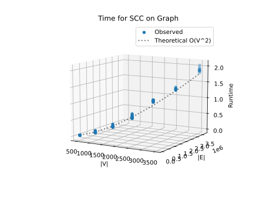
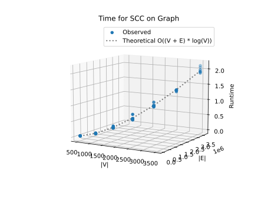

# Project Report - Network Routing

## Baseline

### Design Experience

Talked with Michael about everything mentioned in design.md

### Theoretical Analysis - Dijkstra's With Linear PQ

#### Time 

```py
class LinearPQ:

    def __init__(self):
        self.linear_queue = {}


    def insert(self, weight_info):    # O(1) - all of the lines in this function require a constant amount of time
        node = weight_info[0]
        if len(self.linear_queue) == 0 or node not in self.linear_queue:
            self.linear_queue[node] = [weight_info[1], weight_info[2]]
        else:
            if self.linear_queue[node][1] > weight_info[2]:
                self.linear_queue[node] = [weight_info[1], weight_info[2]]


    def __find_min(self):     # O(n) - the for loop and making a list of the keys in the dict are O(n)
        if len(self.linear_queue) == 0:
            return None
        min_weight = float("inf")
        keys = list(self.linear_queue.keys())  # O(n) - to make a list each key has to be added and there are n number of keys
        min_item = keys[0]
        for key in keys:                       # O(n) - each key in the dict is iterated over and there are n number of items in the dict
            value = self.linear_queue.get(key)
            if value[1] < min_weight:
                min_weight = value[1]
                min_item = [key] + value
        return min_item


    def remove_min(self):  # O(n) - calls __find_min() which has a O(n) complexity
        weight_info = self.__find_min()
        self.linear_queue.pop(weight_info[0])
        return weight_info


def run_dijkstras(graph, pq, source, target): # O(n^2) - because the while loop runs n times and for every time it runs it will go through an operation that takes O(n)
    weights = {source: [None, 0]} 
    path = []
    pq.insert([source, None, 0])
    while not len(pq) != 0:             # O(n^2) because it will run through everything in the pq and each time perform a O(n) operation
        min_value = pq.remove_min()     # O(n) - because remove_min() is a O(n) operation
        current_node = min_value[0]
        prev_node = min_value[1]
        weight = min_value[2]
        children = graph[current_node]
        if current_node not in weights:
            weights[current_node] = [prev_node, weight]
        elif prev_node is not None and weights.get(current_node)[1] > weight + weights.get(prev_node)[1]:
            weights[current_node] = [prev_node, weight + weights.get(prev_node)[1]]
        for key in children:           # O(n) - goes through every item in the dict which is length n
            current_weight = weights.get(current_node)[1]
            if key not in weights or children[key] + current_weight < weights[key][1]:
                if key in weights:
                    weights[key] = children[key] + current_weight
                    continue
                pq.insert((key, current_node, children[key] + current_weight))
    current_node = target
    if target not in weights:
        return [], float('inf')
    while current_node != source:      # O(n) - has the potential to go through every item in the dict which is n items long
        path.insert(0, current_node)
        current_node = weights[current_node][0]
    path.insert(0, source)
    return path, weights.get(target)[1]
```

Overall time complexity is **O(n^2)** because the while loop in ```run_dijkstra()``` runs n number of times to get through every item in the priority queue.
In addition to this, each time the loop is run it takes n amount of time so that it can get through the for loop in ```__find_min()```.

#### Space

```py 
class LinearPQ:

    def __init__(self):
        self.linear_queue = {}


    def insert(self, weight_info):    # O(1) - comparison is constant and adding one item to a dict takes a constant amount of space
        node = weight_info[0]
        if len(self.linear_queue) == 0 or node not in self.linear_queue:
            self.linear_queue[node] = [weight_info[1], weight_info[2]]
        else:
            if self.linear_queue[node][1] > weight_info[2]:
                self.linear_queue[node] = [weight_info[1], weight_info[2]]


    def __find_min(self):     # O(n) - making a list of the keys in the dict is O(n)
        if len(self.linear_queue) == 0:
            return None
        min_weight = float("inf")
        keys = list(self.linear_queue.keys())  # O(n) - to make a list each key has to be added so there is enough space and there are n number of keys
        min_item = keys[0]
        for key in keys:
            value = self.linear_queue.get(key)
            if value[1] < min_weight:
                min_weight = value[1]
                min_item = [key] + value      # O(1) - because value is a fixed size that is very small it takes about constant space to add each item to a new list
        return min_item


    def remove_min(self):  # O(n) - calls __find_min() which has a O(n) complexity
        weight_info = self.__find_min()
        self.linear_queue.pop(weight_info[0])
        return weight_info


def run_dijkstras(graph, pq, source, target): # O(v + e) - the graph that is passed in has to have a dict with v number of nodes and each v has e number of values in it's dict
    weights = {source: [None, 0]} 
    path = []
    pq.insert([source, None, 0])
    while not len(pq) != 0:
        min_value = pq.remove_min()     # O(n) - because remove_min() is a O(n) operation
        current_node = min_value[0]
        prev_node = min_value[1]
        weight = min_value[2]
        children = graph[current_node] # O(1) - because it's only creating a reference and not actually making something new
        if current_node not in weights:
            weights[current_node] = [prev_node, weight]
        elif prev_node is not None and weights.get(current_node)[1] > weight + weights.get(prev_node)[1]:
            weights[current_node] = [prev_node, weight + weights.get(prev_node)[1]]
        for key in children:           # O(n) - goes through every item in the dict which is length n
            current_weight = weights.get(current_node)[1]
            if key not in weights or children[key] + current_weight < weights[key][1]:
                if key in weights:
                    weights[key] = children[key] + current_weight
                    continue
                pq.insert((key, current_node, children[key] + current_weight))
    current_node = target
    if target not in weights:
        return [], float('inf')
    while current_node != source:
        path.insert(0, current_node)
        current_node = weights[current_node][0]
    path.insert(0, source)
    return path, weights.get(target)[1]
```

Overall space complexity is ***O(v + e)*** because while all operations in ```run_dijkstra()``` only take O(n) space, the graph that gets passed in that has to be stored has to be made.
This graph has v number of nodes and each node has a dict for its value which is length e and takes e amount of space.


### Empirical Data - Dijkstra's With Linear PQ

| N    | Density | time (ms) |
|------|---------|-----------|
| 500  | .3      | 0.025     |
| 1000 | .3      | 0.126     |
| 1500 | .3      | 0.293     |
| 2000 | .3      | 0.567     |
| 2500 | .3      | 0.994     |
| 3000 | .3      | 2.12      |
| 3500 | .3      | 2.364     |

### Comparison of Theoretical and Empirical Results - Dijkstra's With Linear PQ

- Theoretical order of growth: O(n^2) 
- Empirical order of growth (if different from theoretical): Same




The theoretical order of growth and actual order of growth match.

## Core

### Design Experience

Talked with Michael about everything mentioned in design.md

### Theoretical Analysis - Dijkstra's With Heap PQ

#### Time 

```py 
class HeapPQ:

    def __init__(self):
        self.heap_queue = []
        self.map_queue = {}

    def insert(self, weight_info):  # O(log n ) - everything other the while loop takes constant time so the while loops time complexity is the amount of time it will take the function
        node = weight_info[0]
        if len(self.heap_queue) == 0 or node not in self.map_queue or self.map_queue[node][1] > weight_info[2]:
            if not node in self.map_queue:
                self.heap_queue.append(weight_info)
                self.map_queue[node] = [len(self.heap_queue) - 1, weight_info[2]]
            else:
                self.map_queue[node][1] = weight_info[2]
                self.heap_queue[self.map_queue[node][0]] = weight_info
            i = self.map_queue[node][0]
            while i > 0:      # O(log n) - has the potential to go through each level of the heap which has a height of log n
                parent = (i - 1) // 2
                if weight_info[2] < self.heap_queue[parent][2]:
                    self.heap_queue[i], self.heap_queue[parent] = self.heap_queue[parent], self.heap_queue[i]
                    self.map_queue[self.heap_queue[i][0]][0] = i
                    self.map_queue[self.heap_queue[parent][0]][0] = parent
                    i = parent
                else:
                    break
            self.map_queue[node] = [i, weight_info[2]]


    def remove_min(self): # O(log n) - everything other than the while loop takes constant time so the complexity of thee loop becomes the complexity of the function
        if len(self.heap_queue) == 0:
            return None
        min_value = self.heap_queue[0]
        self.heap_queue[0] = self.heap_queue[-1]
        self.heap_queue.pop()
        self.map_queue.pop(min_value[0])
        size_heap = len(self.heap_queue)
        if size_heap == 0:
            return min_value
        self.map_queue[self.heap_queue[0][0]][0] = 0
        i = 0
        while True:        # O(log n) - the height of the heap and thereby number of iterations the loop can go through is O(log n)
            left_child = i * 2 + 1
            right_child = i * 2 + 2
            smallest = i
            if left_child < size_heap and self.heap_queue[left_child][2] < self.heap_queue[smallest][2]:
                smallest = left_child
            if right_child < size_heap and self.heap_queue[right_child][2] < self.heap_queue[smallest][2]:
                smallest = right_child
            if smallest == i:
                break
            self.heap_queue[i], self.heap_queue[smallest] = self.heap_queue[smallest], self.heap_queue[i]
            self.map_queue[self.heap_queue[i][0]][0] = i
            self.map_queue[self.heap_queue[smallest][0]][0] = smallest
            i = smallest
        return min_value


def run_dijkstras(graph, pq, source, target): # O((v+e) log n) - the while loop takes the most time so its complexity becomes the complexity for the whole function
    weights = {source: [None, 0]} 
    path = []
    pq.insert([source, None, 0])        # O(1) - because this is the only item in the heap it takes constant time to add it as there will e no comparisons or moving of positions
    while not len(pq) != 0:             # O((v + e) log n) - each call to insert or remove the minimum from the priority queue takes log n amount of time and these functions are called once per node, v, and each node has e number of paths leading away that have to be explored
        min_value = pq.remove_min()     # O(log n) - because remove_min() is a O(log n) operation
        current_node = min_value[0]
        prev_node = min_value[1]
        weight = min_value[2]
        children = graph[current_node]
        if current_node not in weights:
            weights[current_node] = [prev_node, weight]
        elif prev_node is not None and weights.get(current_node)[1] > weight + weights.get(prev_node)[1]:
            weights[current_node] = [prev_node, weight + weights.get(prev_node)[1]]
        for key in children:           # O(n) - goes through every item in the dict which is length n
            current_weight = weights.get(current_node)[1]
            if key not in weights or children[key] + current_weight < weights[key][1]:
                if key in weights:
                    weights[key] = children[key] + current_weight
                    continue
                pq.insert((key, current_node, children[key] + current_weight))  # O(log n) - insert has a complexity of O(log n)
    current_node = target
    if target not in weights:
        return [], float('inf')
    while current_node != source:      # O(n) - has the potential to go through every item in the dict which is n items long
        path.insert(0, current_node)
        current_node = weights[current_node][0]
    path.insert(0, source)
    return path, weights.get(target)[1]
```

The longest amount of time taken will be going through the while loop. While most of its code takes constant time, inserting and removing from the priority queue can take up to ***O(log n)***.
In addition to this, these methods will be called for every node, v, and for almost every value in the nodes associated value, e.
This makes the overall time complexity of the program ***O((v + e) log n)***.

#### Space

```py 
class HeapPQ:

    def __init__(self):
        self.heap_queue = []
        self.map_queue = {}

    def insert(self, weight_info):  # O(1) - adding one item to a list and or a dict takes a constant amount of space. The complexity for this over the course of the running of run_dijkstra() though will be O(n) because new items will be added n number of time
        node = weight_info[0]
        if len(self.heap_queue) == 0 or node not in self.map_queue or self.map_queue[node][1] > weight_info[2]:
            if not node in self.map_queue:
                self.heap_queue.append(weight_info)
                self.map_queue[node] = [len(self.heap_queue) - 1, weight_info[2]]
            else:
                self.map_queue[node][1] = weight_info[2]
                self.heap_queue[self.map_queue[node][0]] = weight_info
            i = self.map_queue[node][0]
            while i > 0:
                parent = (i - 1) // 2
                if weight_info[2] < self.heap_queue[parent][2]:
                    self.heap_queue[i], self.heap_queue[parent] = self.heap_queue[parent], self.heap_queue[i]
                    self.map_queue[self.heap_queue[i][0]][0] = i
                    self.map_queue[self.heap_queue[parent][0]][0] = parent
                    i = parent
                else:
                    break
            self.map_queue[node] = [i, weight_info[2]]


    def remove_min(self): # O(1) - nothing is taking up new space other than min_value, and it only takes one item which takes constant space
        if len(self.heap_queue) == 0:
            return None
        min_value = self.heap_queue[0]  # O(1) - the size of the item it takes is constant
        self.heap_queue[0] = self.heap_queue[-1]
        self.heap_queue.pop()
        self.map_queue.pop(min_value[0])
        size_heap = len(self.heap_queue)
        if size_heap == 0:
            return min_value
        self.map_queue[self.heap_queue[0][0]][0] = 0
        i = 0
        while True:
            left_child = i * 2 + 1
            right_child = i * 2 + 2
            smallest = i
            if left_child < size_heap and self.heap_queue[left_child][2] < self.heap_queue[smallest][2]:
                smallest = left_child
            if right_child < size_heap and self.heap_queue[right_child][2] < self.heap_queue[smallest][2]:
                smallest = right_child
            if smallest == i:
                break
            self.heap_queue[i], self.heap_queue[smallest] = self.heap_queue[smallest], self.heap_queue[i]
            self.map_queue[self.heap_queue[i][0]][0] = i
            self.map_queue[self.heap_queue[smallest][0]][0] = smallest
            i = smallest
        return min_value


def run_dijkstras(graph, pq, source, target): # O(v+e) - the graph itself has v number of nodes and each node has e number of items in it so space is needed for each node, v, and each of its values, e
    weights = {source: [None, 0]} 
    path = []
    pq.insert([source, None, 0])        # O(1) - because this is the only item in the heap it takes constant space to add
    while not len(pq) != 0:             # O(n) - each call to insert is constant but this function is called n times which means n amount of space has to be allocated
        min_value = pq.remove_min()     # O(1) - because remove_min takes constant space
        current_node = min_value[0]
        prev_node = min_value[1]
        weight = min_value[2]
        children = graph[current_node]
        if current_node not in weights:
            weights[current_node] = [prev_node, weight]
        elif prev_node is not None and weights.get(current_node)[1] > weight + weights.get(prev_node)[1]:
            weights[current_node] = [prev_node, weight + weights.get(prev_node)[1]]
        for key in children:
            current_weight = weights.get(current_node)[1]
            if key not in weights or children[key] + current_weight < weights[key][1]:
                if key in weights:
                    weights[key] = children[key] + current_weight
                    continue
                pq.insert((key, current_node, children[key] + current_weight))  # O(log n) - insert has a complexity of O(log n)
    current_node = target
    if target not in weights:
        return [], float('inf')
    while current_node != source:      # O(n) - has the potential to add every item in the dict which is n items long and would take up n amount of space
        path.insert(0, current_node)
        current_node = weights[current_node][0]
    path.insert(0, source)
    return path, weights.get(target)[1]
```

The largest amount of space used is for the graph which has v number of items and for each of these values requires an additional e amount of space for each of the values items.
This makes the space cost for the program ***O(v + e)***.

### Empirical Data - Dijkstra's With Heap PQ

| N    | Density | time (ms) |
|------|---------|-----------|
| 500  | .3      | 0.027     |
| 1000 | .3      | 0.12      |
| 1500 | .3      | 0.342     |
| 2000 | .3      | 0.627     |
| 2500 | .3      | 1.135     |
| 3000 | .3      | 1.482     |
| 3500 | .3      | 1.912     |


### Comparison of Theoretical and Empirical Results - Dijkstra's With Heap PQ

- Theoretical order of growth: O((v + e) log n)
- Empirical order of growth (if different from theoretical): same



The theoretical and actual order of growth seem to match.

### Relative Performance Of Linear versus Heap PQ Performance

*Fill me in*

## Stretch 1

### Design Experience

*Fill me in*

### Empirical Data

| N    | Density | heap time (ms) | linear PQ time (ms) |
|------|---------|----------------|---------------------|
| 500  | .6      |                |                     |
| 1000 | .6      |                |                     |
| 1500 | .6      |                |                     |
| 2000 | .6      |                |                     |
| 2500 | .6      |                |                     |
| 3000 | .6      |                |                     |
| 3500 | .6      |                |                     |


| N    | Density | heap time (ms) | linear PQ time (ms) |
|------|---------|----------------|---------------------|
| 500  | 1       |                |                     |
| 1000 | 1       |                |                     |
| 1500 | 1       |                |                     |
| 2000 | 1       |                |                     |
| 2500 | 1       |                |                     |
| 3000 | 1       |                |                     |
| 3500 | 1       |                |                     |

### Plot

*Fill me in*

### Discussion

*Fill me in*

## Stretch 2

### Design Experience

*Fill me in*

### Provided Graph Generation Algorithm Explanation

*Fill me in*

### Selected Graph Generation Algorithm Explanation

*Fill me in*

#### Screenshots of Working Graph Generation Algorithm


## Project Review

*Fill me in*

