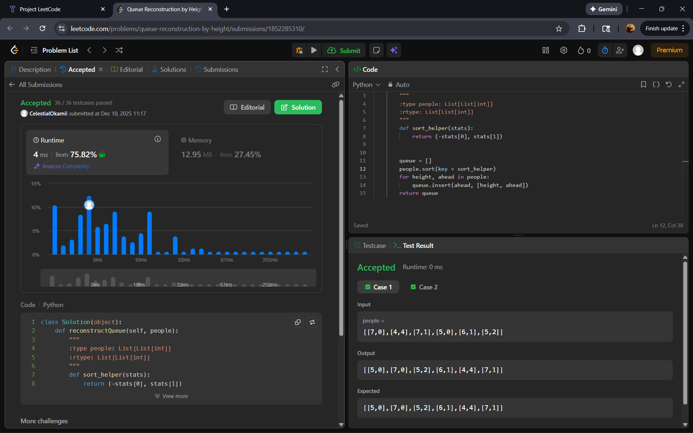
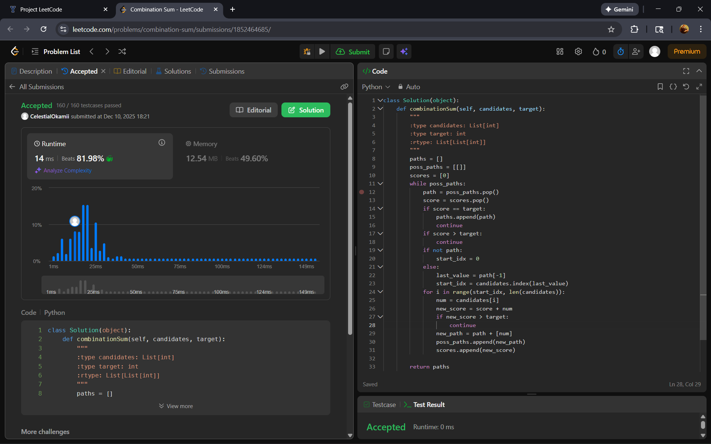
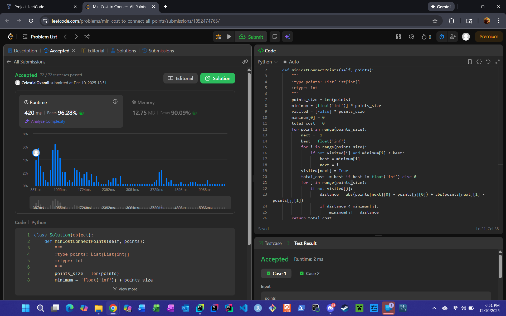
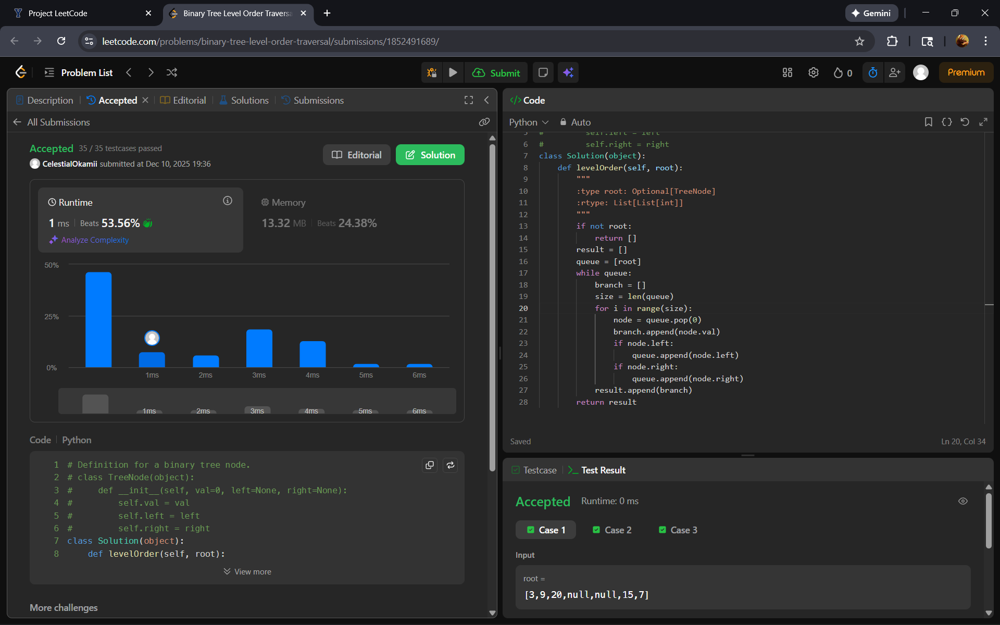
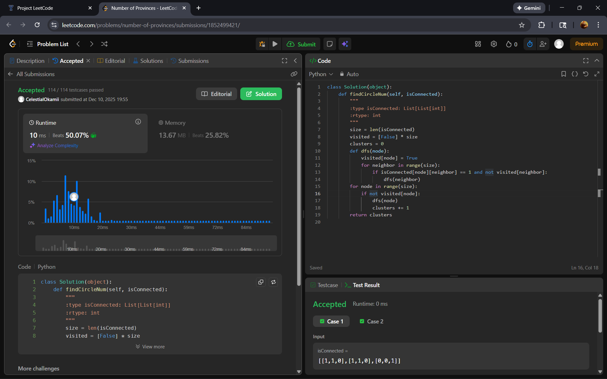
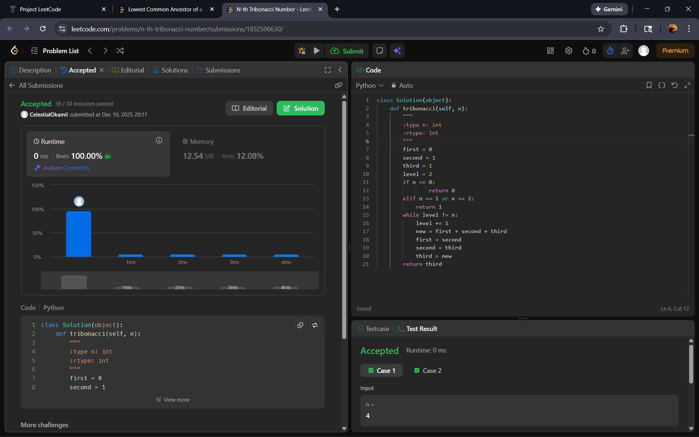
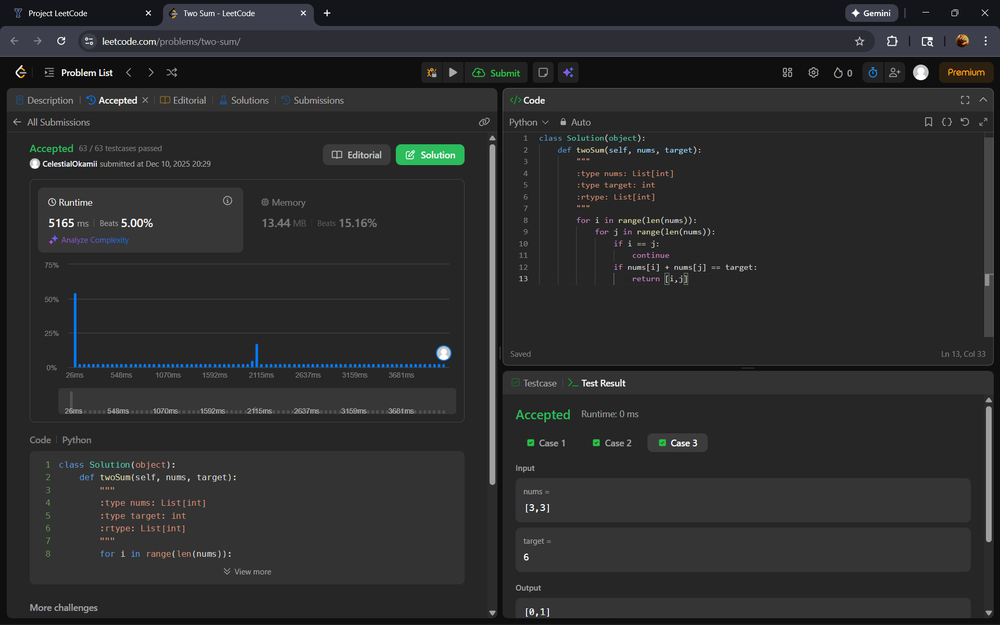

# Project Leetcode

## Baseline 

### Baseline Problem 1

#### Problem Information

Problem Name: *406. Queue Reconstruction by Height*

[Submission Link](https://leetcode.com/problems/queue-reconstruction-by-height/submissions/1852285310)



#### Time Complexity

```py 
class Solution(object):
    def reconstructQueue(self, people):
        """
        :type people: List[List[int]]
        :rtype: List[List[int]]
        """
        def sort_helper(stats):  # O(1) - Making something negative takes constant time
            return (-stats[0], stats[1])


        queue = []
        people.sort(key = sort_helper)  # O(nlog(n)) - timesort takes n log(n)
        for height, ahead in people:  # O(n^2) - repeats n times and each time it repeats it costs O(n) because of the insertion
            queue.insert(ahead, [height, ahead]) # O(n) - inserting can take up to O(n) because it may have to shift n items if it is inserting at the beginning of the list
        return queue
```

**O(n^2)**
For loop takes the most time which makes the function cost O(n^2).


#### Space Complexity

```py 
class Solution(object):
    def reconstructQueue(self, people):
        """
        :type people: List[List[int]]
        :rtype: List[List[int]]
        """
        def sort_helper(stats):
            return (-stats[0], stats[1])


        queue = []  # O(n) - while inserting takes constant space, n items will end up being inserted which will require n amount of space
        people.sort(key = sort_helper)
        for height, ahead in people:
            queue.insert(ahead, [height, ahead])  # O(1) - inserting one element takes constant space
        return queue
```

**O(n)**
Queue takes the most space which makes the overall function cost O(n) space.

### Baseline Problem 2

#### Problem Information

Problem Name: *39. Combination Sum*

[Submission Link](https://leetcode.com/problems/combination-sum/submissions/1852464685/)



#### Time Complexity

```py 
def combinationSum(self, candidates, target):
        """
        :type candidates: List[int]
        :type target: int
        :rtype: List[List[int]]
        """
        paths = []   
        poss_paths = [[]]
        scores = [0]  
        while poss_paths:   # O(p*n*m) - for each potential path(p) the list will have to be gone through m number of times for the for loop and index(). In addition to this the partial path essentially has n number of appends to copy the list which takes n amount of time
            path = poss_paths.pop()
            score = scores.pop()
            if score == target:
                paths.append(path)
                continue
            if score > target:
                continue 
            if not path:
                start_idx = 0
            else:
                last_value = path[-1]
                start_idx = candidates.index(last_value) # O(m) - index() can go through the entire list which means that it can take up to m time
            for i in range(start_idx, len(candidates)):  # O(m) - repeats m times which takes m amount of time
                num = candidates[i]
                new_score = score + num
                if new_score > target:
                    continue
                new_path = path + [num]  # O(n) - because we're copying a path that can be up n items long and therefore cost n number of appends
                poss_paths.append(new_path)
                scores.append(new_score)

        return paths
```

**O(p\*m\*n)**
There are three different variables to consider as p, m, and, n are likely to all have different values. Basically, for each of the potential paths (p)
a path will be gone through (m) and at each part of the path, the path will be remade and have an item added to it (n).

#### Space Complexity

```py 
def combinationSum(self, candidates, target):
        """
        :type candidates: List[int]
        :type target: int
        :rtype: List[List[int]]
        """
        paths = []   # O(n*m) - can have at least n items of size m added to it
        poss_paths = [[]]  # O(n*m) - each append costs n because a list n items long and needs n amount of space is being added and there will be m number of additions to the list which means that m * n space will be needed
        scores = [0]  
        while poss_paths:
            path = poss_paths.pop()
            score = scores.pop()
            if score == target:
                paths.append(path)
                continue
            if score > target:
                continue 
            if not path:
                start_idx = 0
            else:
                last_value = path[-1]
                start_idx = candidates.index(last_value)
            for i in range(start_idx, len(candidates)):
                num = candidates[i]
                new_score = score + num
                if new_score > target:
                    continue
                new_path = path + [num] # O(n) - path is copied and has n new items added to it which will require n amount of space
                poss_paths.append(new_path) # O(n) - appending one item takes constant time but because this is actually list the list could contain n number of items and will therefore require n amount of space
                scores.append(new_score)

        return paths
```

**O(n\*m)**
Because the items in paths and poss_paths take more space than one item and are length n they will need enough space for m number of n sized items.

### Baseline Problem 3

#### Problem Information

Problem Name: *1584. Min Cost to Connect All Points*

[Submission Link](https://leetcode.com/problems/min-cost-to-connect-all-points/submissions/1852474765/)



#### Time Complexity

```py 
def minCostConnectPoints(self, points):
        """
        :type points: List[List[int]]
        :rtype: int
        """
        points_size = len(points)
        minimum = [float('inf')] * points_size  # O(n) - essentially appending n number of times which takes n amount of time
        visited = [False] * points_size         # O(n) - doing the same thing as mentioned above
        minimum[0] = 0
        total_cost = 0
        for point in range(points_size):  # O(n^2) - repeats n times and each time it repeats, it repeats another n times which takes n^2 time
            next = -1
            best = float('inf')
            for i in range(points_size):  # O(n) - repeats n times which takes n amount of time
                if not visited[i] and minimum[i] < best:
                    best = minimum[i]
                    next = i
            visited[next] = True
            total_cost += best if best != float('inf') else 0
            for j in range(points_size):  # O(n) - repeats n times which takes n amount of time
                if not visited[j]:
                    distance = abs(points[next][0] - points[j][0]) + abs(points[next][1] - points[j][1])
                    if distance < minimum[j]:
                        minimum[j] = distance
        return total_cost
```

**O(n^2)**
For each repetition of the outermost for loop another repetition will be made.

#### Space Complexity

```py 
def minCostConnectPoints(self, points):
        """
        :type points: List[List[int]]
        :rtype: int
        """
        points_size = len(points)
        minimum = [float('inf')] * points_size   # O(n) - makes a new list of size n
        visited = [False] * points_size          # O(n) - makes a list which requires n amount of space
        minimum[0] = 0
        total_cost = 0
        for point in range(points_size):
            next = -1
            best = float('inf')
            for i in range(points_size):
                if not visited[i] and minimum[i] < best:
                    best = minimum[i]
                    next = i
            visited[next] = True
            total_cost += best if best != float('inf') else 0
            for j in range(points_size):
                if not visited[j]:
                    distance = abs(points[next][0] - points[j][0]) + abs(points[next][1] - points[j][1])
                    if distance < minimum[j]:
                        minimum[j] = distance
        return total_cost
```

**O(n)**
The most space taken up is taken in the making of new lists both of which are n items long.


## Core

### Core Problem 1

#### Problem Information

Problem Name: *102. Binary Tree Level-order Traversal*

[Submission Link](https://leetcode.com/problems/binary-tree-level-order-traversal/)



#### Time Complexity

```py 
def levelOrder(self, root):
        """
        :type root: Optional[TreeNode]
        :rtype: List[List[int]]
        """
        if not root:
            return []
        result = []
        queue = [root]
        while queue: # O(m * n^2) - repeats m times for however many items are in the queue and each time it repeats it takes n^2 time for the for loop and pop
            branch = []
            size = len(queue)
            for i in range(size): # O(n^2) - repeats everything inside n times and for each repetition the list has to shift which takes n amount of time
                node = queue.pop(0)  # O(n) - because the beginning of the list is being removed everything has to shift left which means that n items have to shift which takes n amount of time
                branch.append(node.val)
                if node.left:
                    queue.append(node.left)
                if node.right:
                    queue.append(node.right)
            result.append(branch)
        return result
```

**O(m\*n^2)**
The while loop takes the most space because it will keep running until the queue is empty and each time it runs it will repeat n times and have items shifted n times.

#### Space Complexity

```py 
def levelOrder(self, root):
        """
        :type root: Optional[TreeNode]
        :rtype: List[List[int]]
        """
        if not root:
            return []
        result = []  # O(m*n) - needs m amount of space to store m n sized nodes 
        queue = [root] # O(m*n) - can only store up to n/2 items (m) because it's a tree but we round it up to n for easy of describing the amount of space it needs. Each of the items we then store in it are require n amount of space
        while queue:
            branch = [] # O(n) - can theoretically store up to n number of items and therefore needs n amount of space
            size = len(queue)
            for i in range(size):
                node = queue.pop(0)
                branch.append(node.val)
                if node.left:
                    queue.append(node.left)
                if node.right:
                    queue.append(node.right)
            result.append(branch)
        return result
```

**O(m*n)**
Because the lists are storing lists they require n amount of space for however many items (n) they will store.

### Core Problem 2

#### Problem Information

Problem Name: *547. Number of Provinces*

[Submission Link](https://leetcode.com/problems/number-of-provinces/)



#### Time Complexity

```py 
def findCircleNum(self, isConnected):
        """
        :type isConnected: List[List[int]]
        :rtype: int
        """
        size = len(isConnected)
        visited = [False] * size  # O(n) - basically repeats n times to make a list so takes n amount of time
        clusters = 0
        def dfs(node): 
            visited[node] = True
            for neighbor in range(size): # O(n^2) - repeats n times and every time it repeats it calls itself which guarantees another n amount of time will be taken to fun the for loop on neighbors
                if isConnected[node][neighbor] == 1 and not visited[neighbor]:
                    dfs(neighbor) # O(n) - repeats n times because of the for loop in each call
        for node in range(size): # O(n) - repeats n number of times which takes n amount of time
            if not visited[node]:
                dfs(node)
                clusters += 1
        return clusters
```

**O(n^2)**
Because dfs is recursive, every time it runs, it will go through every neighbor and for every neighbor will go through that neighbor's neighbors.

#### Space Complexity

```py 
def findCircleNum(self, isConnected):
        """
        :type isConnected: List[List[int]]
        :rtype: int
        """
        size = len(isConnected)
        visited = [False] * size  # O(n) - adds n number of items which require n amount of space
        clusters = 0
        def dfs(node):
            visited[node] = True
            for neighbor in range(size):
                if isConnected[node][neighbor] == 1 and not visited[neighbor]:
                    dfs(neighbor)
        for node in range(size):
            if not visited[node]:
                dfs(node)
                clusters += 1
        return clusters
```

**O(n)**
The only thing being stored here other that the matrix as a parameter is a list of n items requiring n amount of space.

### Core Problem 3

#### Problem Information

Problem Name: *1137. N-th Tribonacci Number*

[Submission Link](https://leetcode.com/problems/n-th-tribonacci-number/submissions/1852506630/)



#### Time Complexity

```py 
def tribonacci(self, n):
        """
        :type n: int
        :rtype: int
        """
        first = 0
        second = 1
        third = 1
        level = 2
        if n == 0:
                return 0
        elif n == 1 or n == 2:
            return 1
        while level != n: # O(n) - runs n number of times to get to its answer
            level += 1
            new = first + second + third
            first = second
            second = third
            third = new
        return third
```

**O(n)**
The while loop will run n times in order to add everything making the function cost n amount of time.

#### Space Complexity

```py 
def tribonacci(self, n): # O(1) - everything stored here is constant
        """
        :type n: int
        :rtype: int
        """
        first = 0
        second = 1
        third = 1
        level = 2
        if n == 0:
                return 0
        elif n == 1 or n == 2:
            return 1
        while level != n:
            level += 1
            new = first + second + third
            first = second
            second = third
            third = new
        return third
```

**O(1)**
Nothing that doesn't take up constant space is being store here.

## Stretch 1

### Stretch 1 Problem 1

#### Problem Information

Problem Name: *1. Two Sum*

[Submission Link](https://leetcode.com/problems/two-sum/)



#### Time Complexity

```py 
def twoSum(self, nums, target):
        """
        :type nums: List[int]
        :type target: int
        :rtype: List[int]
        """
        for i in range(len(nums)):  # O(n^2) - repeats n times and for every repitition it repeats another n times
            for j in range(len(nums)): # O(n) - repeats n times taking n amount of time
                if i == j:
                    continue
                if nums[i] + nums[j] == target:
                    return [i,j]
```

**O(n^2)**
Each time the for loop repeats everything is repeated all over again by its inner for loop.

#### Space Complexity

```py 
def twoSum(self, nums, target):  # O(1) - not storing anything that isn't a parameter
        """
        :type nums: List[int]
        :type target: int
        :rtype: List[int]
        """
        for i in range(len(nums)):
            for j in range(len(nums)):
                if i == j:
                    continue
                if nums[i] + nums[j] == target:
                    return [i,j]
```

**O(1)**
Nothing is being stored here other than the list in the parameters

## Stretch 2

### Stretch 2 Problem 1

#### Problem Information

Problem Name: *fill me in*

[Submission Link]()


#### Time Complexity

*Fill me in*

#### Space Complexity

*Fill me in*

## Project Review

Met with Jackson Gray, we had both done the Two Sum, Tribonacci Number, and Binary Tree Level-order Traversal. We actually used the same methods
for all of these and ended up with about the same time and space complexity, the main differences being that I tended to use lists
and he tended to use queues. He also did the triangles and squares problems. His approach to the triangle problem seemed interesting to 
me because he mentioned that he thought that it was easier to start from the bottom and work up while my initial thoughts were that it would
be easier to start at the top and work down. His implementation of squares also seemed fun and made me wish that I had done it instead of the 
binary tree which I did not enjoy.