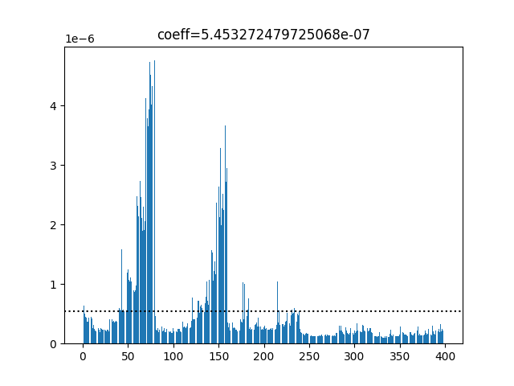
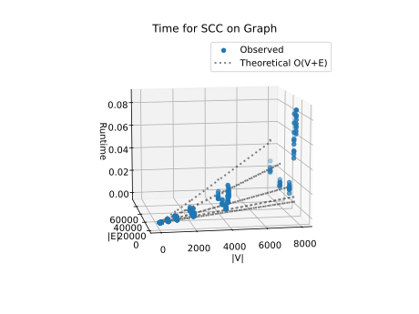

# Project Report - Network Analysis SCCs

## Baseline

### Design Experience

The graph which will be used for this project will be directed which when using recursion to do a depth first search (dfs)
means that runtime will be O(n) and the space complexity of adding to my dictionary for each call will be O(n).

I decided to use a dictionary where the nodes of the graph are the keys and the values are lists containing
the pre and post numbers so that I wouldn't have to implement any code to get my information in this format after
running my dfs function. For my dfs function I need a starting node, the dictionary to store nodes and their pre and
post numbers in, and a graph to traverse. The dfs function will be recursive and will check to see if all of the descendants
of the current node have been visited. During each visit to a new node, the node will be added to the dictionary and a pre 
number will be assigned to it. If a descendant hasn't been visited then the first descendant that hasn't been visited will be visited
calling the dfs function using the descendant node as the new node to search. This pattern of checking descendant and visiting 
them will continue until a node is reached which either doesn't have any descendants or whose descendant have all been 
visited already. At that point the dfs function will assign a post number to that node and will return to the previous node and either visit any unvisited descendants 
or if its descendant have all been visited assign a post number to the node. This will continue until all nodes that can be visited from the starting node
are visited and assigned pre and post number at which the dictionary containing the pre and post numbers for each node
will be returned.

* This design was gone over with my brother who has a bachelors in Computer Science

### Theoretical Analysis - Pre/Post Order Traversal

#### Time 

```py
def prepost(graph : GRAPH) -> list[dict[str, list[int]]]:
    keys = list(graph.keys())                       #O(n) - to iterate over each key and add it to a list happens n (the number of keys) times
    dfs_forest = list()                             #O(1) - happens once and is done
    current_tree = {}                               #O(1) - happens once and is done
    trees = {}                                      #O(1) - happens one time takes up a constant amount of time
    count = 1                                       #O(1) - assigning an int to a variable is constant
    if not isinstance(graph.get(keys[0]), list):    #O(1) - indexing, dictionary lookup, and checking type are all constant
        for item in keys:                           #O(n) - iterating n times
            graph[item] = list(graph.get(item))     #O(n) - assigning each element in a string to a list n times
    for key in keys:                                #O(n) - goes over each node once
        if not key in trees:                        #O(1) - accessing a dict value is constant
            current_tree, count = dfs(graph, key, current_tree, count, trees)  #O(n * E) - goes over each node once and goes over every edge leading away once
            dfs_forest.append(current_tree)         #O(1) - adding 1 one element to a list is constant
            count += 1                              #O(1) - adding to an int is constant
            trees = trees | current_tree            #O(n) - adding keys to trees once per key (n) in current_tree
            current_tree = {}                       #O(1) - making an empty dict is constant
    return dfs_forest                               #O(1) - returning a list that is done being changed is constant


def dfs(graph, node, current_tree, count, trees):
    current_tree[node] = [count]                            #O(1) - assigning a value is constant
    for item in graph[node]:                                #O(n) - happens once for every edge leaving node
        if not item in current_tree and not item in trees:  #O(1) - accessing and testing one elemt is constant
            current_tree, count = dfs(graph, item, current_tree, count + 1, trees)  #O(n * E) - each node is visited once and each edge is travelled to once
        elif item in trees or not item == graph[node][-1]:  #O(1) - comparing and accessing one value is constant
            continue                                        #O(1) - skipping the rest is constant
        else:
            current_tree[node].append(count + 1)            #O(1) - adding once to a small list is constant
            return current_tree, count + 1                  #O(1) - returning an finished dict and a number is constant
    current_tree[node].append(count + 1)                    #O(1) - adding one thing to a small tree is constant
    return current_tree, count + 1                          #O(1) - return a finished dict and a number is constant
```

The call to dfs takes the longest because dfs goes over every node and every nodes descendant once which leads to a time complexity of O(n + E) (number of nodes + number of edges leading to descendants).

#### Space

```py 
def prepost(graph : GRAPH) -> list[dict[str, list[int]]]:
    keys = list(graph.keys())                       #O(n) - making a list n items long
    dfs_forest = list()                             #O(1) - making a empty list takes up a constant amount of space
    current_tree = {}                               #O(1) - making a empty dict takes constant space
    trees = {}                                      #O(1) - making an empty dict takes a constant amount of space
    count = 1                                       #O(1) - storing an int takes constant space
    if not isinstance(graph.get(keys[0]), list):    #O(1) - looking up and checking conditions doesn't take any space that isn't already allocated
        for item in keys:                           #O(1) - accessing values in a list takes no additional space
            graph[item] = list(graph.get(item))     #O(n) - making a new list for each element in string
    for key in keys:                                #O(1) - accessing info takes no new space
        if not key in trees:                        #O(1) - checking condition and accessing info takes no new space
            current_tree, count = dfs(graph, key, current_tree, count, trees)   #O(n) - needs n amount of space for every item in a new dict
            dfs_forest.append(current_tree)         #O(n) - needs new space for n length dict
            count += 1                              #O(1) - changing value of about equivalent size takes no new space
            trees = trees | current_tree            #O(n) - making a new dict with length of trees and length current_tree entries
            current_tree = {}                       #O(1) - making a empty dict takes constant space
    return dfs_forest                               #O(1) - returning something with space already allocated


def dfs(graph, node, current_tree, count, trees):
    current_tree[node] = [count]                     #O(1) - constant amount of time to store int variable and constant time for creating a one item list
    for item in graph[node]:                         #O(1) - accessing already stored info doesn't take any new memory
        if not item in current_tree and not item in trees:  #O(1) - accessing and checking conditions for info takes no new space
            current_tree, count = dfs(graph, item, current_tree, count + 1, trees)  #O(n) - creates a new stack frame for each call which is n times
        elif item in trees or not item == graph[node][-1]:  #O(1) - accessing and checking info takes no new space
            continue                                 #O(1) - continuing takes no new space
        else:
            current_tree[node].append(count + 1)     #O(1) - adding to an int is constant and appending one item to a list is about constant
            return current_tree, count + 1           #O(1) - returning info and adding to an int takes constant space
    current_tree[node].append(count + 1)             #O(1) - appending and adding 1 item is about constant
    return current_tree, count + 1                   #O(1) - returning a finished dict and number takes no new space
```

dfs_trees will take the most memory by the end of the program. This is because for each new tree it will have to make room for a new dict n nodes long and will have to do this for t number of trees, 
however adding the trees should take negligible space. This makes the total space complexity O(n).

### Empirical Data

| density factor | size | V    | E    | runtime   |
|----------------|------|------|------|-----------|
| 0.25           | 10   | 10   | 10   | 0.0000115 |
| 0.25           | 50   | 50   | 50   | 0.0000516 |
| 0.25           | 100  | 100  | 100  | 0.0000513 |
| 0.25           | 500  | 500  | 500  | 0.000425  |
| 0.25           | 2000 | 2000 | 2000 | 0.00451   |
| 0.25           | 4000 | 4000 | 4000 | 0.0201    |
| 0.25           | 8000 | 8000 | 8000 | 0.0759    |
| 0.5            | 10   | 10   | 10   | 0.0000071 |
| 0.5            | 50   | 50   | 50   | 0.0000282 |
| 0.5            | 100  | 100  | 100  | 0.00006   |
| 0.5            | 500  | 500  | 500  | 0.000401  |
| 0.5            | 2000 | 2000 | 2000 | 0.00385   |
| 0.5            | 4000 | 4000 | 4000 | 0.016     |
| 0.5            | 8000 | 8000 | 8000 | 0.059     |
| 1              | 10   | 10   | 10   | 0.0000110 |
| 1              | 50   | 50   | 50   | 0.0000814 |
| 1              | 100  | 100  | 100  | 0.000139  |
| 1              | 500  | 500  | 500  | 0.000578  |
| 1              | 2000 | 2000 | 2000 | 0.00305   |
| 1              | 4000 | 4000 | 4000 | 0.00567   |
| 1              | 8000 | 8000 | 8000 | 0.0168    |
| 2              | 10   | 10   | 10   | 0.0000079 |
| 2              | 50   | 50   | 50   | 0.0000361 |
| 2              | 100  | 100  | 100  | 0.0000797 |
| 2              | 500  | 500  | 500  | 0.000432  |
| 2              | 2000 | 2000 | 2000 | 0.00291   |
| 2              | 4000 | 4000 | 4000 | 0.00616   |
| 2              | 8000 | 8000 | 8000 | 0.0133    |
| 3              | 10   | 10   | 10   | 0.0000076 |
| 3              | 50   | 50   | 50   | 0.0000467 |
| 3              | 100  | 100  | 100  | 0.000123  |
| 3              | 500  | 500  | 500  | 0.000812  |
| 3              | 2000 | 2000 | 2000 | 0.00336   |
| 3              | 4000 | 4000 | 4000 | 0.00755   |
| 3              | 8000 | 8000 | 8000 | 0.0185698 |


### Comparison of Theoretical and Empirical Results

- Theoretical order of growth: O(n + E)
- Measured constant of proportionality for theoretical order: 5.453272479725068e-07



- Empirical order of growth: 



The theoretical growth matches the empirical growth.


## Core

### Design Experience

*Fill me in*

### Theoretical Analysis - SCC

#### Time 

*Fill me in*

#### Space

*Fill me in*

### Empirical Data


| density factor | size  | V | E | runtime |
|----------------|-------|---|---|---------|
| 0.25           | 10    |   |   |         |
| 0.25           | 50    |   |   |         |
| 0.25           | 100   |   |   |         |
| 0.25           | 500   |   |   |         |
| 0.25           | 2000  |   |   |         |
| 0.25           | 4000  |   |   |         |
| 0.25           | 80000 |   |   |         |
| 0.5            | 10    |   |   |         |
| 0.5            | 50    |   |   |         |
| 0.5            | 100   |   |   |         |
| 0.5            | 500   |   |   |         |
| 0.5            | 2000  |   |   |         |
| 0.5            | 4000  |   |   |         |
| 0.5            | 8000  |   |   |         |
| 1              | 10    |   |   |         |
| 1              | 50    |   |   |         |
| 1              | 100   |   |   |         |
| 1              | 500   |   |   |         |
| 1              | 2000  |   |   |         |
| 1              | 4000  |   |   |         |
| 1              | 8000  |   |   |         |
| 2              | 10    |   |   |         |
| 2              | 50    |   |   |         |
| 2              | 100   |   |   |         |
| 2              | 500   |   |   |         |
| 2              | 2000  |   |   |         |
| 2              | 4000  |   |   |         |
| 2              | 8000  |   |   |         |
| 3              | 10    |   |   |         |
| 3              | 50    |   |   |         |
| 3              | 100   |   |   |         |
| 3              | 500   |   |   |         |
| 3              | 2000  |   |   |         |
| 3              | 4000  |   |   |         |
| 3              | 8000  |   |   |         |


### Comparison of Theoretical and Empirical Results

- Theoretical order of growth: *copy from section above* 
- Measured constant of proportionality for theoretical order: 
- Empirical order of growth (if different from theoretical): 
- Measured constant of proportionality for empirical order: 


*Fill me in*

## Stretch 1

### Design Experience

*Fill me in*

### Articulation Points Discussion 

*Fill me in*

## Stretch 2

### Design Experience

*Fill me in*

### Dataset Description

*Fill me in*

### Findings Discussion

*Fill me in*

## Project Review

I went over all of my report and code with Zachary Smith and we did this for over 15 minutes.
We discussed the time and space complexities of my functions and went over my empirical data.